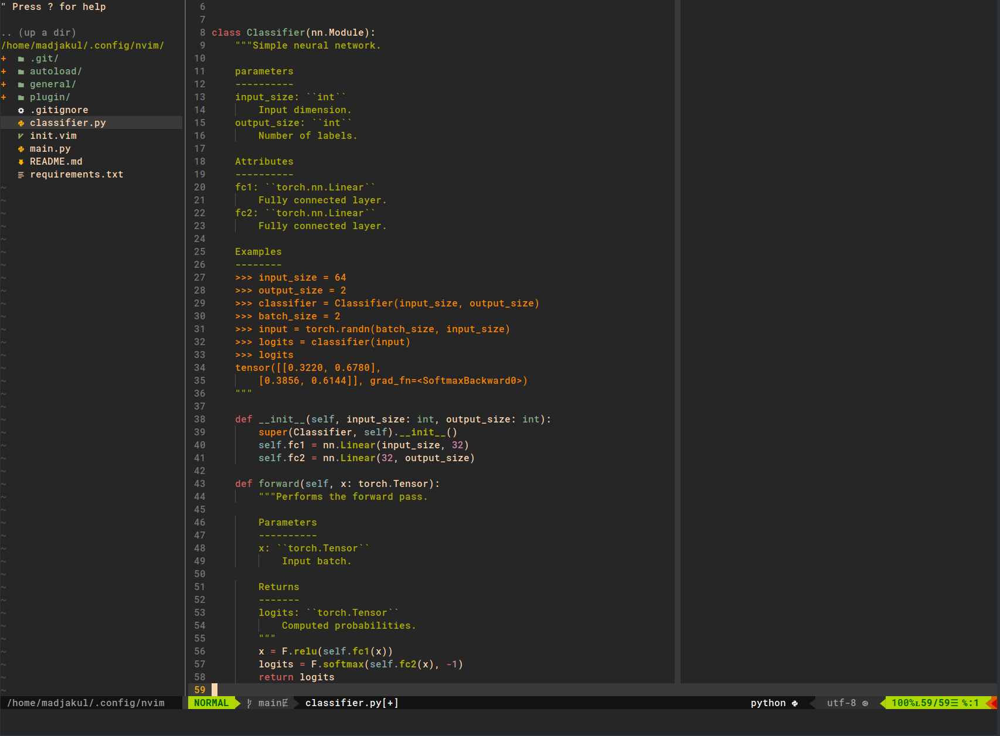
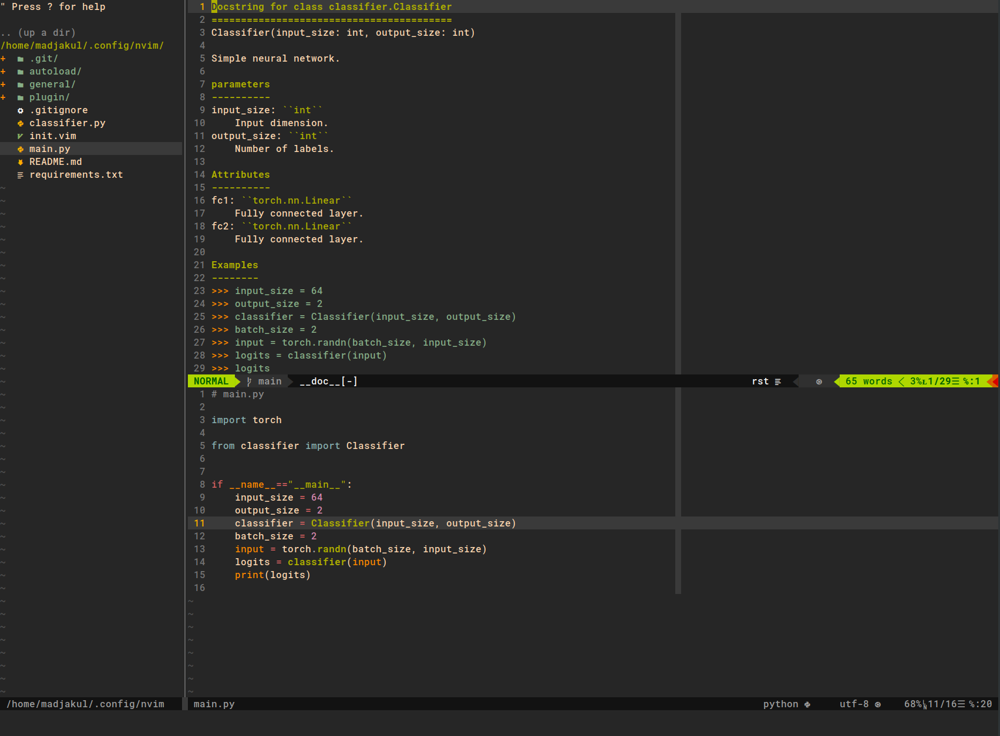
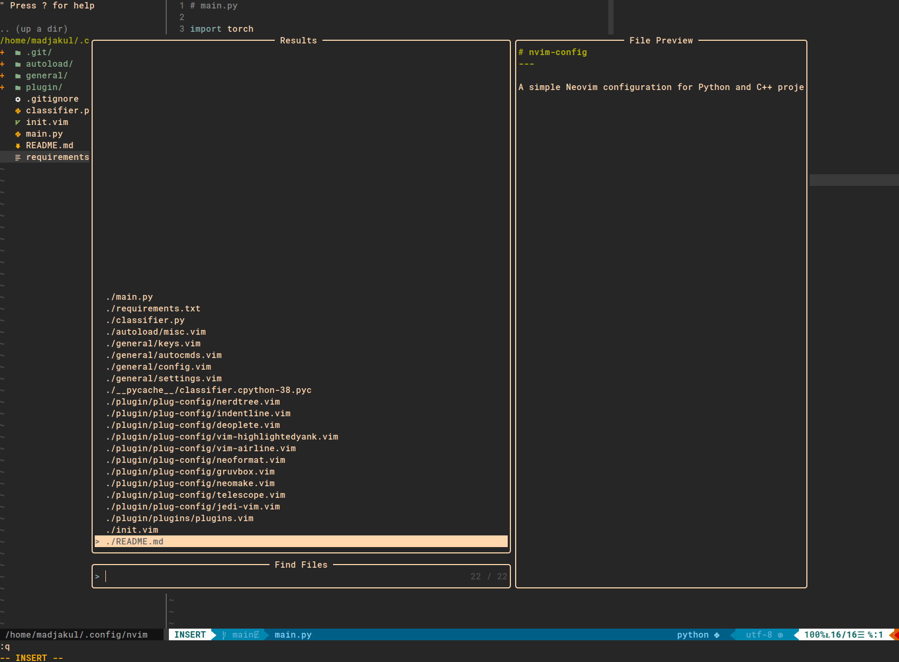

# config.nvim
---

A simple Neovim configuration for Python and C++ projects. My configuration uses [vim-plug](https://github.com/junegunn/vim-plug) for neovim on Linux/Unix.


## Installation

Make sure you have [vim-plug](https://github.com/junegunn/vim-plug) installed!

Access config file.
```sh
cd ~/.config/
```

Clone the repository with the name "nvim" and access it
```sh
git clone https://github.com/Madjakul/config.nvim.git nvim
cd nvim
```

Make sure you have the right to execute `install_config.sh` script and execute it within the cloned directory
```sh
chmod u+x ./install_config.sh
./install_config.sh
```

Everything should be installed and ready to use, check health with
```sh
nvim .
```

###

Some usefull LSP linters
```
:CocInstall coc-sh coc-clangd coc-cmake coc-html coc-java coc-tsserver coc-json coc-markdownlint marlonfan/coc-phpls sql-language-server
```


## Usage

Here are some useful commands.


### Navigating through the files
|Intent|Keys|
|------|----|
|Going to the left window|<kbd>Ctrl</kbd>+<kbd>h</kbd>|
|Going to the right window|<kbd>Ctrl</kbd>+<kbd>l</kbd>|
|Going to the top window|<kbd>Ctrl</kbd>+<kbd>k</kbd>|
|Going to the bottom|<kbd>Ctrl</kbd>+<kbd>j</kbd>|
|Saving the current file|<kbd>Ctrl</kbd>+<kbd>s</kbd>|



### Python's specific
|Intent|Keys|
|------|----|
|Display function/class' documentation|<kbd>K</kbd>|
|Deleting from the beginning of the current line until the end of the previous line|<kbd>k</kbd><kbd>J</kbd>|



### Other
The fuzzy search using [telescope](https://github.com/nvim-telescope/telescope.nvim) has been remapped to <kbd>\\</kbd><kbd>f</kbd><kbd>f</kbd>.




## References

### List of plugins
* [deoplete](https://github.com/Shougo/deoplete.nvim), a dark powered asynchronous completion framework for neovim/Vim8
* [jedi-vim](https://github.com/davidhalter/jedi-vim), a VIM binding to the autocompletion library Jedi.
* [vim-airline](https://github.com/vim-airline/vim-airline), a lean & mean status/tabline for vim that's light as air.
* [auto-pairs](https://github.com/jiangmiao/auto-pairs): insert or delete brackets, parens, quotes in pair.
* [neoformat](https://github.com/sbdchd/neoformat), a (Neo)vim plugin for formatting code.
* [vim-prettier](https://github.com/prettier/vim-prettier), a vim plugin wrapper for prettier, pre-configured with custom default prettier settings.
* [nerdtree](https://github.com/preservim/nerdtree) The NERDTree is a file system explorer for the Vim editor. Using this plugin, users can visually browse complex directory hierarchies, quickly open files for reading or editing, and perform basic file system operations.
* [neomake](https://github.com/neomake/neomake): Neomake is a plugin for Vim/Neovim to asynchronously run programs.
* [vim-highlightedyank](https://github.com/machakann/vim-highlightedyank): Make the yanked region apparent!
* [gruvbox](https://github.com/morhetz/gruvbox): Designed as a bright theme with pastel 'retro groove' colors and light/dark mode switching in the way of solarized.
* [vim-commentary](https://github.com/tpope/vim-commentary): Comment stuff out.
* [vim-sourrond](https://github.com/tpope/vim-surround): Surround.vim is all about "surroundings": parentheses, brackets, quotes, XML tags, and more. 
* [vim-fugitive](https://github.com/tpope/vim-fugitive): Fugitive is the premier Vim plugin for Git.
* [vim-polyglot](https://github.com/sheerun/vim-polyglot): A collection of language packs for Vim.
* [IndentLine](https://github.com/Yggdroot/indentLine): This plugin is used for displaying thin vertical lines at each indentation level for code indented with spaces.
* [telescope.nvim](https://github.com/nvim-telescope/telescope.nvim): telescope.nvim is a highly extendable fuzzy finder over lists.
* [vim-devicons](https://github.com/ryanoasis/vim-devicons): Adds filetype glyphs (icons) to various vim plugins.
* [nerdtree-syntax-highlight](https://github.com/tiagofumo/vim-nerdtree-syntax-highlight): This adds syntax for nerdtree on most common file extensions.

### Contributions
Highly inspired from [charlyalizadeh/nvim_config](https://github.com/charlyalizadeh/nvim_config).
