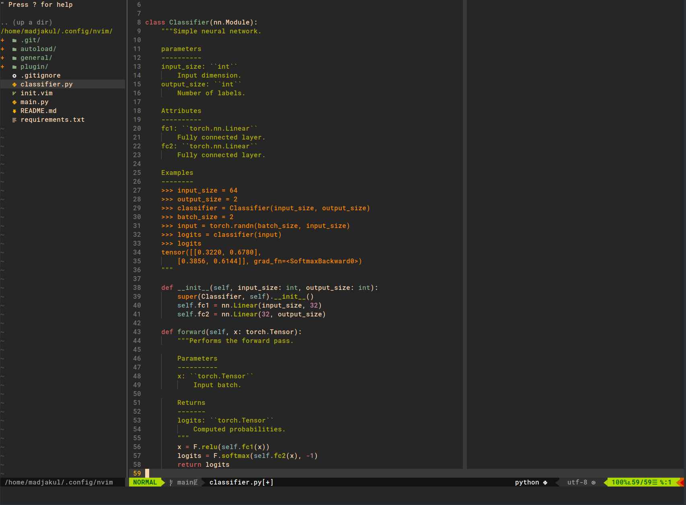
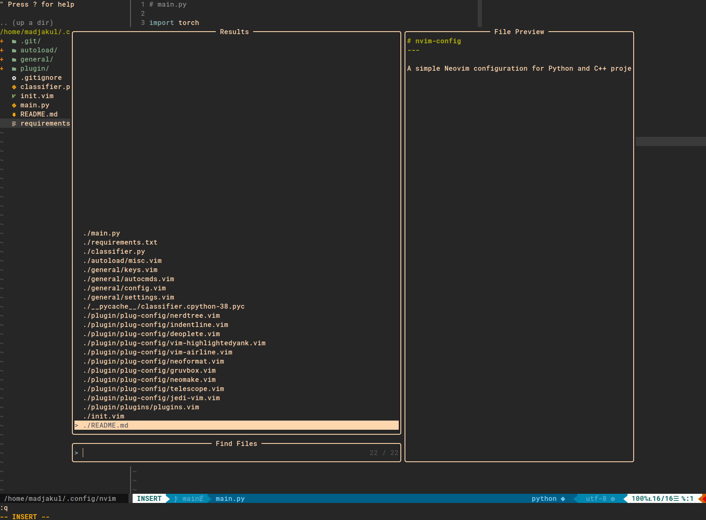
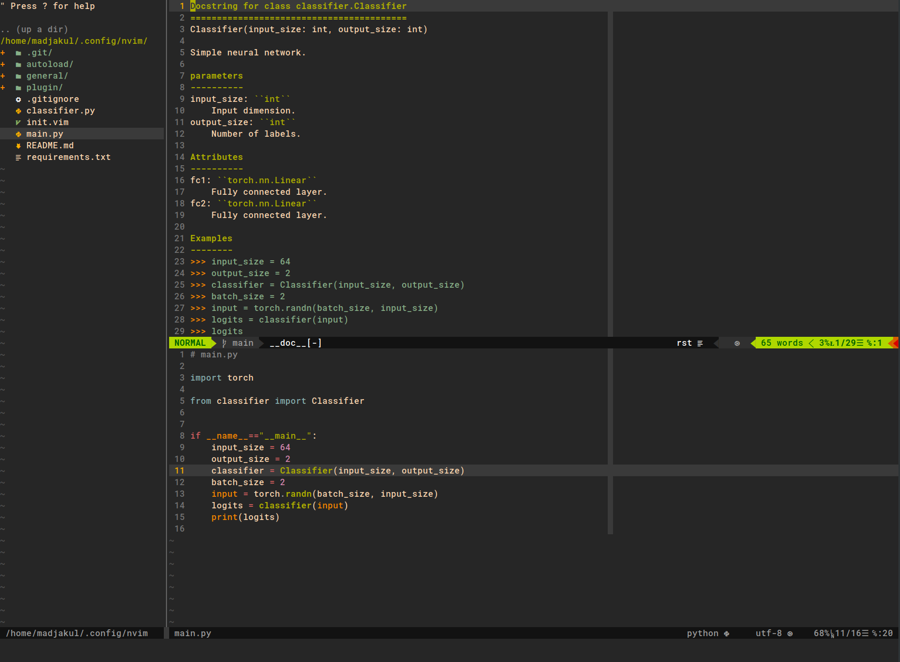

# config.nvim

A simple Neovim configuration.

---

Mostly suited for Python and C++ projects and using [vim-plug](https://github.com/junegunn/vim-plug).


## Features




### Navigating through files

|Intent|Keys|
|------|----|
|Opening Telescope|<kbd>\\</kbd>+<kbd>f</kbd><kbd>f</kbd>|
|Going to the left window|<kbd>Ctrl</kbd>+<kbd>h</kbd>|
|Going to the right window|<kbd>Ctrl</kbd>+<kbd>l</kbd>|
|Going to the top window|<kbd>Ctrl</kbd>+<kbd>j</kbd>|
|Going to the bottom|<kbd>Ctrl</kbd>+<kbd>k</kbd>|




### Python's specific

|Intent|Keys|
|------|----|
|Displaying function/class' documentation|<kbd>K</kbd>|




### Misc

|Intent|Keys|
|------|----|
|Deleting from the beginning of the current line until the end of the previous line|<kbd>k</kbd><kbd>J</kbd>|
|Saving the current file|<kbd>Ctrl</kbd>+<kbd>s</kbd>|


## Installation

### Default

Make sure you have [vim-plug](https://github.com/junegunn/vim-plug) installed!

Access config file.
```sh
cd ~/.config/
```

Clone the repository with the name "nvim" and access it
```sh
git clone https://github.com/Madjakul/config.nvim.git nvim
cd nvim
```

Make sure you have the right to execute `install_config.sh` script and execute it within the cloned directory
```sh
chmod u+x ./install_config.sh
./install_config.sh
```


### From source

Start by downloading and installing the app-image following [the official guide](https://github.com/neovim/neovim/releases).

Start by downloading the release you want. replace the string between triangle brackets with the correct version.

```sh
wget -c https://github.com/neovim/neovim/releases/download/v<desired_release>/nvim-linux64.tar.gz
# Extract the app-image
tar xzvf nvim-linux64.tar.gz
# You can now run neovim with
./nvim-linux64/bin/nvim
```

Optionnally, you can remap the command to run neovim so you don't have to type in the whole path everytime.

```sh
alias nvim="/path/to/nvim-linux64/bin/nvim" >> ~/.bashrc
. ~/.bashrc
```

You can now run the command `nvim .` from anywhere.

As my config uses [coc.nvim](https://github.com/neoclide/coc.nvim), you'll also need to [install Node.js from source](https://nodejs.org/download/release/).

```sh
wget -c https://nodejs.org/download/release/v<desired_release>/node-v<desired_release>-linux-x64.tar.gz
# Extract Node.js
tar xzvf node-v<desired_release>-linux-x64.tar.gz
```

You now need to add Node.js to your path by appending those two lines into your `.bashrc`.

```sh
export NODEJS_HOME=/path/to/nodejs_v<desired_release> # Use the absolute path
export PATH=$PATH:$HOME/bin:$NODEJS_HOME/bin
```

Close your `.bashrc` file and check that node is correctly installed before adding the path to Node.js to you `.vimrc` file.

```sh
node --version
let g:coc_node_path = '/path/to/nodejs_v<desired_release>' >> ~\.vimrc
```


### Network install

You can run `./install_config.sh` for a quick install with the correct font and dependencies. However, for a minimal install, you can run

```sh
sudo apt remove neovim -y
sudo add-apt-repository ppa:neovim-ppa/stable # Latest version
sudo apt-get update
sudo apt-get install neovim
```

Install Vim-plug with 

```sh
sh -c 'curl -fLo "${XDG_DATA_HOME:-$HOME/.local/share}"/nvim/site/autoload/plug.vim --create-dirs \
    https://raw.githubusercontent.com/junegunn/vim-plug/master/plug.vim'
```

[Install Node.js](https://github.com/nodesource/distributions?tab=readme-ov-file#ubuntu-versions)

```sh
# https://github.com/nvm-sh/nvm/issues/2972
curl -fsSL https://deb.nodesource.com/setup_<desired_version>.x | sudo -E bash - &&\ # Change the desired version
sudo apt-get install -y nodejs
```

Finally, Install and update the plugins

```sh
nvim +PlugInstall +PlugUpdate +qall
```


## Usage

Once everything is installed, you can use neovim with

```sh
nvim .
```


## References

### Contributions

Highly inspired from [charlyalizadeh/nvim_config](https://github.com/charlyalizadeh/nvim_config).
